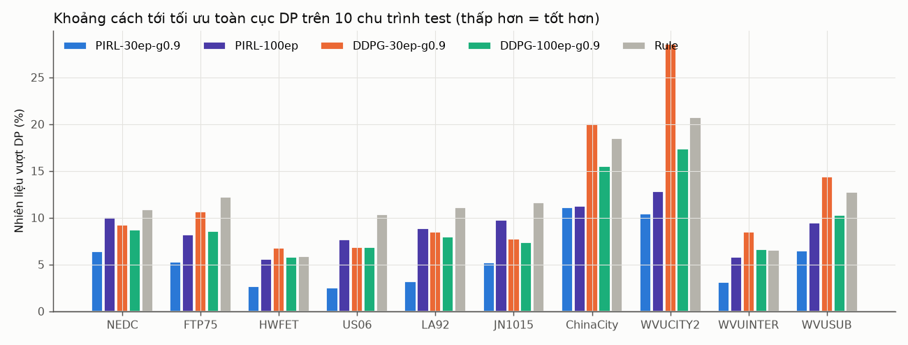
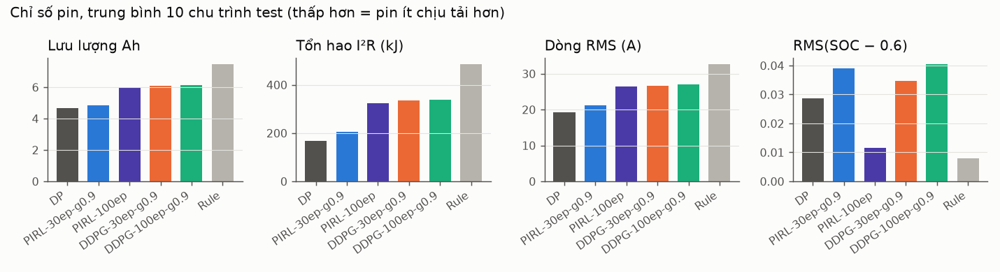
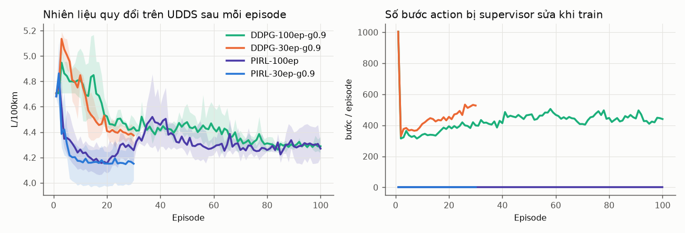
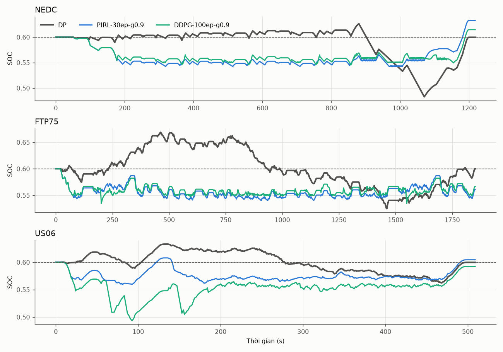

# Benchmark: PIRL vs DDPG vs DP

Trọng tâm: **tiêu thụ năng lượng** và **pin**. Code: [`benchmark.py`](benchmark.py) (train, DP, đánh giá) và [`report.py`](report.py) (bảng, hình). Số liệu đầy đủ nằm ở [`results/tables.md`](results/tables.md) và [`results/results.json`](results/results.json).

```bash
python PIRL/benchmark.py train --algo pirl --episodes 30 --seed 0 --gamma 0.9   # 1 run
python PIRL/benchmark.py evaluate                                             # DP + đánh giá mọi run
python PIRL/report.py                                                         # bảng + hình
```

## 1. Thiết lập

| | |
|---|---|
| Mô hình xe | `HEVPhysics` (Prius đơn giản: cân bằng lực dọc trục, pin R_int 6.5 Ah, dòng xả/sạc tối đa 196/120 A, cửa sổ SOC 0.4–0.8) |
| Chu trình train | UDDS (1 chu trình duy nhất) |
| **10 benchmark (chưa thấy khi train)** | NEDC, FTP75, HWFET, US06, LA92, JN1015, ChinaCity, WVUCITY2, WVUINTER, WVUSUB |
| Kịch bản | (a) **nominal**: xe giống mô hình. (b) **mismatch**: xe thật khác mô hình (+10% khối lượng, +10% Cd, pin lão hoá R +30%, Q −10%); PIRL vẫn dùng mô hình nominal bên trong |
| Seed | 3 seed cho mỗi cấu hình RL, báo cáo mean ± std |
| SOC đầu | 0.6. Nhiên liệu được **quy đổi theo chênh lệch năng lượng pin** để so sánh công bằng |

**Các thuật toán**

| Tên | Mô tả |
|---|---|
| **DP** | Quy hoạch động (lưới 801 SOC × 101 action), biết trước toàn bộ chu trình. Là cận dưới lý thuyết, không chạy online được |
| **PIRL** | Code trong [`pirl_hev.py`](pirl_hev.py): physics feature layer, physics constraint layer, critic `r_phys + γ·V_nn(f_phys)` |
| **DDPG** | Giống `DDPG_Prius.py` của repo (mạng 200-100-50, action = sigmoid × 56 kW, critic Q(s,a) hộp đen), viết lại bằng PyTorch |
| **Rule** | Động cơ chạy ≥ 20 kW khi SOC < 0.6 |

**Protocol công bằng**
- Cùng reward, cùng chuẩn hoá state, cùng lr, τ, batch, buffer, số bước warm-up và chu trình train.
- Cả hai thuật toán được thử γ ∈ {0.99, 0.9}, với 30 episode, và DDPG còn được train 100 episode (gấp 3.3 lần ngân sách).
- **Cấu hình báo cáo được chọn chỉ dựa trên chu trình train UDDS**, không nhìn vào 10 chu trình test.
  - Được chọn: PIRL-30ep-γ0.9, DDPG-30ep-γ0.9, DDPG-100ep-γ0.9.
  - Mọi biến thể khác vẫn có trong `results/tables.md`.

## 2. Kết quả chính: nhiên liệu trên 10 chu trình test (L/100km, quy đổi SOC)

| Chu trình | DP | **PIRL-30ep** | DDPG-30ep | DDPG-100ep | Rule | PIRL vs DDPG-30 | PIRL vs DDPG-100 |
|---|---|---|---|---|---|---|---|
| UDDS *(train)* | 3.930 | **4.151 ± 0.097** | 4.374 ± 0.063 | 4.288 ± 0.056 | 4.415 | ✅ | ✅ |
| NEDC | 4.381 | **4.660 ± 0.066** | 4.785 ± 0.033 | 4.761 ± 0.004 | 4.856 | ✅ | ✅ |
| FTP75 | 4.103 | **4.318 ± 0.082** | 4.539 ± 0.075 | 4.453 ± 0.052 | 4.604 | ✅ | ✅ |
| HWFET | 4.756 | **4.882 ± 0.043** | 5.079 ± 0.124 | 5.032 ± 0.036 | 5.036 | ✅ | ✅ |
| US06 | 5.605 | **5.745 ± 0.024** | 5.988 ± 0.174 | 5.988 ± 0.140 | 6.184 | ✅ | ✅ |
| LA92 | 4.751 | **4.903 ± 0.045** | 5.155 ± 0.102 | 5.130 ± 0.075 | 5.278 | ✅ | ✅ |
| JN1015 | 3.814 | **4.013 ± 0.110** | 4.110 ± 0.027 | 4.095 ± 0.033 | 4.258 | ✅ | ✅ |
| ChinaCity | 3.210 | **3.566 ± 0.186** | 3.853 ± 0.028 | 3.707 ± 0.056 | 3.804 | ✅ | ✅ |
| WVUCITY2 | 3.277 | **3.619 ± 0.196** | 4.213 ± 0.102 | 3.845 ± 0.045 | 3.956 | ✅ | ✅ |
| WVUINTER | 4.534 | **4.676 ± 0.053** | 4.920 ± 0.127 | 4.833 ± 0.025 | 4.830 | ✅ | ✅ |
| WVUSUB | 3.714 | **3.954 ± 0.113** | 4.247 ± 0.042 | 4.096 ± 0.016 | 4.188 | ✅ | ✅ |
| **Thắng** | | | | | | **10/10** | **10/10** |



## 3. Tổng hợp chỉ số năng lượng và pin (trung bình 10 chu trình test, kịch bản nominal)

| # | Chỉ số | DP | **PIRL-30ep** | DDPG-30ep | DDPG-100ep | Rule |
|---|---|---|---|---|---|---|
| 1 | Nhiên liệu quy đổi SOC (L/100km) | 4.215 | **4.434** | 4.689 | 4.594 | 4.699 |
| 2 | Chênh lệch so với DP (%) | 0 | **+5.6** | +12.1 | +9.5 | +12.1 |
| 3 | Nhiên liệu với hệ số quy đổi bất lợi¹ (L/100km) | 4.215 | **4.512** | 4.730 | 4.681 | 4.633 |
| 4 | Tổng năng lượng nhiên liệu + pin (kWh/100km) | 37.15 | **38.34** | 40.95 | 39.67 | 42.06 |
| 5 | Lưu lượng Ah qua pin, chỉ số lão hoá (Ah) | 4.68 | **4.84** | 6.10 | 6.12 | 7.49 |
| 6 | Tổn hao nhiệt I²R trong pin (kJ) | 168 | **205** | 336 | 339 | 487 |
| 7 | Dòng pin RMS (A) | 19.2 | **21.1** | 26.6 | 27.1 | 32.7 |
| 8 | Dòng pin đỉnh (A) | 64.5 | **94.0** | 117.7 | 118.0 | 141.4 |
| 9 | Vi phạm giới hạn pin/SOC (bước/chu trình) | 0 | **0** | 2.3 | 2.4 | 0 |
| 10 | Action bị supervisor sửa (bước/chu trình)² | 0 | **0** | 380 | 270 | 0 |
| 11 | Vi phạm ràng buộc khi train (tổng, 3 seed TB) | – | **0** | 13 693 | 42 707 | – |
| 12 | Episode để hội tụ (≤ 2% kết quả cuối) | – | **5.3** | 15.7 | 41.7 | – |

¹ Giả định nạp lại pin bằng động cơ hiệu suất 25% và hiệu suất sạc 85%, tức phạt việc rút pin nặng hơn khoảng 60%. PIRL vẫn thắng DDPG 10/10 chu trình.
² Phần lớn là lệnh nổ máy khi xe đang phanh hoặc đứng yên, bị supervisor ép về 0.

**Kịch bản mismatch** (xe nặng hơn, pin lão hoá; PIRL vẫn dùng mô hình cũ bên trong):

| | DP | **PIRL-30ep** | DDPG-30ep | DDPG-100ep | Rule |
|---|---|---|---|---|---|
| Nhiên liệu quy đổi SOC (L/100km) | 4.692 | **4.936** | 5.244 | 5.149 | 5.278 |
| Chênh lệch so với DP | 0 | **+5.6%** | +12.6% | +10.1% | +13.0% |
| Thắng DDPG | | **10/10** | | | |



## 4. Tốc độ học và an toàn khi train



- **Tốc độ học:** PIRL đạt mức nhiên liệu cuối sau khoảng 5 episode. DDPG cần khoảng 16 episode (bản 30ep) và 42 episode (bản 100ep), và kết quả cuối vẫn kém hơn.
- **An toàn khi train:** PIRL có **0** action bị sửa trong suốt quá trình train, kể cả khi đang khám phá với noise lớn, nhờ physics constraint layer. DDPG có khoảng 400–500 bước bị supervisor sửa mỗi episode.



## 5. Vì sao PIRL tốt hơn

1. **Critic không phải học phần tức thời.** Nhiên liệu và SOC kế tiếp được tính chính xác bằng phương trình, NN chỉ học giá trị dài hạn `V(SOC, v, a)`. Critic của DDPG phải xấp xỉ toàn bộ `Q(s,a)` từ dữ liệu nhiễu.
2. **Gradient của actor là gradient vật lý thật** (`∂fuel/∂P_eng`, `∂SOC'/∂P_eng` qua mô hình pin R_int). Vì vậy actor học ra được việc chia công suất sao cho dòng pin nhỏ, nên tổn hao I²R thấp hơn khoảng 40% so với DDPG.
3. **Action luôn khả thi**, nên không lãng phí mẫu vào các action bị supervisor sửa. Kiến thức này cũng tổng quát hoá sang chu trình mới và sang xe có tham số khác.

## 6. Giới hạn: đọc trước khi dùng các số này

- **Mọi benchmark chạy trên cùng mô hình đơn giản mà PIRL nhúng vào**, đây là lợi thế sẵn có của PIRL.
  - Kịch bản mismatch chỉ đổi tham số, không đổi cấu trúc mô hình.
  - Chưa kiểm tra trên `Prius_model_new.py` (bản đồ BSFC và hiệu suất motor thật). Đó là bước cần làm trước khi công bố.
- **Giữ SOC kém hơn một chút.**
  - PIRL-γ0.9 kết thúc chu trình với SOC trung bình 0.575, |ΔSOC cuối| = 0.031, so với 0.022–0.029 của DDPG.
  - RMS(SOC − 0.6) của PIRL-γ0.9 là 0.039. Các biến thể γ = 0.99 bám SOC tốt hơn (0.012–0.015) nhưng tốn nhiên liệu hơn.
  - Nhiên liệu đã được quy đổi, và dù dùng hệ số bất lợi thì PIRL vẫn thắng.
- **Số lần khởi động máy:** PIRL khoảng 88 lần mỗi chu trình so với DP khoảng 45. Reward chưa phạt tiêu chí này.
- Với hệ số quy đổi bất lợi, **Rule-based** tốt hơn PIRL trên JN1015, ChinaCity, WVUCITY2, dù PIRL vẫn thắng DDPG ở cả 10 chu trình.
- Chỉ có 3 seed. Trên một số chu trình (JN1015, ChinaCity), khoảng ± của PIRL đè lên DDPG, nên chênh lệch chưa có ý nghĩa thống kê mạnh.
- DDPG được viết lại bằng PyTorch với replay đồng đều (repo gốc dùng Prioritized Replay trên TF1), không phải chạy lại code TF gốc.
