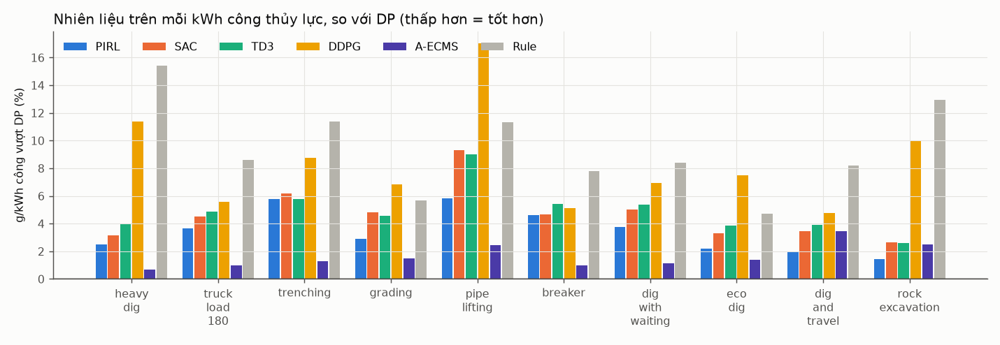
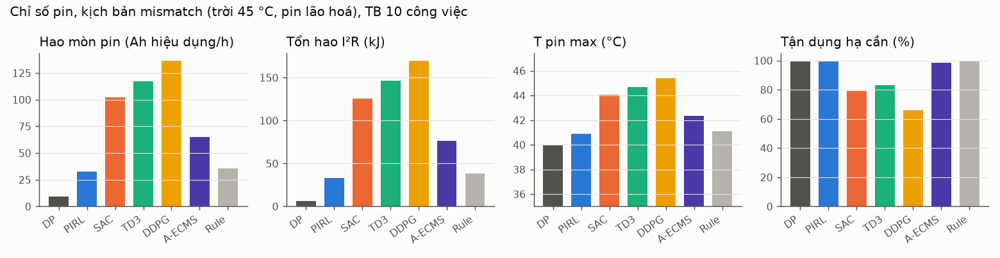
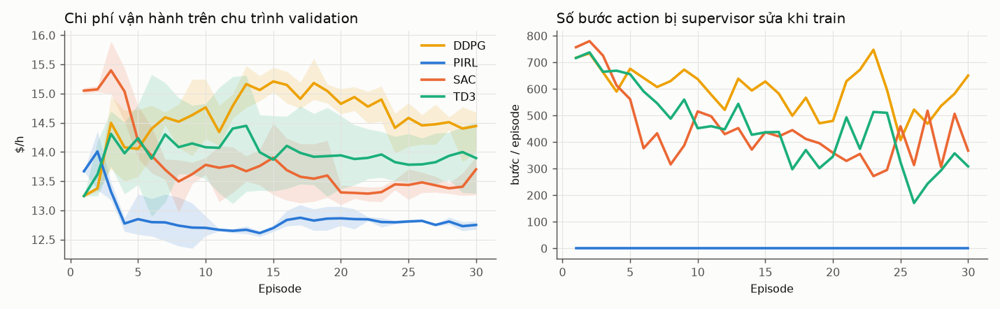
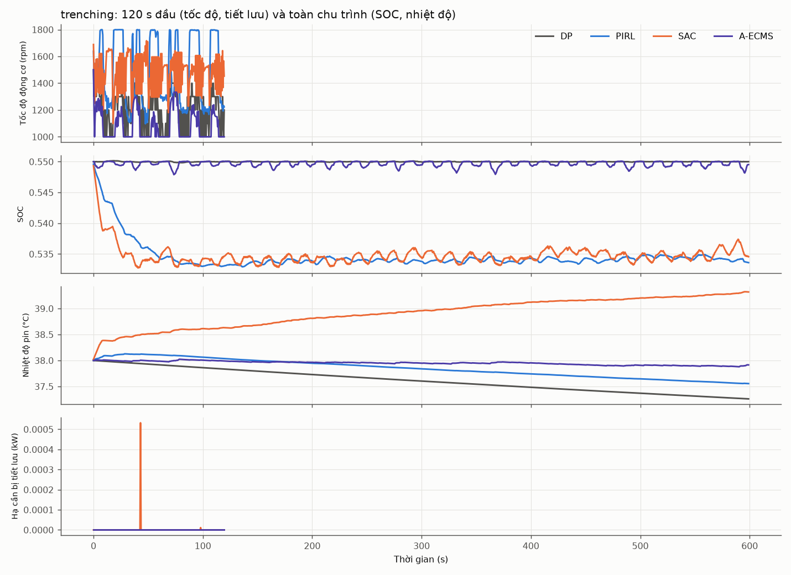

# Benchmark EMS máy xúc hybrid: PIRL vs DP, A-ECMS, SAC, TD3, DDPG, Rule

Mô hình và thiết lập: xem [`README.md`](README.md). Toàn bộ bảng số nằm ở [`results/tables.md`](results/tables.md).

## Protocol
- **Train:** 30 episode × 600 s (bước 0.5 s) trên `train_mixed`, mỗi episode sinh một chu trình mới. SOC ban đầu ∈ [0.45, 0.65], nhiệt độ pin ban đầu ∈ [33, 45] °C.
- **Chọn tham số:**
  - γ ∈ {0.95, 0.99} cho mọi RL, chọn trên validation bằng **seed 0**. Kết quả báo cáo dùng **seed 1–3 riêng biệt**.
  - Rule và A-ECMS được tìm lưới trên cùng chu trình validation với cùng hàm mục tiêu.
- **Test:** 10 công việc cố định, 2 kịch bản:
  - nominal;
  - mismatch: động cơ và bơm mòn, pin lão hoá (R +40%, Q −15%), trời 45 °C.
- **DP:** lưới 3 chiều SOC × tốc độ × nhiệt độ pin, biết trước toàn bộ chu trình, giữ SOC cuối = 0.55.
- **Chỉ số chính: g diesel (quy đổi SOC) trên mỗi kWh công thủy lực thực sự thực hiện.** Lý do: một EMS có thể "tiết kiệm" nhiên liệu bằng cách hạ tốc độ động cơ khiến bơm thiếu dầu. Máy khi đó làm ít việc hơn, nên chỉ số L/h không phản ánh đúng.

## Kết quả chính (trung bình 10 công việc test, 3 seed)

| Chỉ số | DP | **PIRL** | SAC | TD3 | DDPG | A-ECMS | Rule |
|---|---|---|---|---|---|---|---|
| g/kWh công, nominal | 220.7 | **228.3** | 231.0 | 231.6 | 239.1 | 224.3 | 241.4 |
| Chênh lệch so với DP, nominal | 0 | **+3.5%** | +4.7% | +4.9% | +8.4% | +1.6% | +9.4% |
| Chênh lệch so với DP, mismatch | 0 | **+3.5%** | +5.4% | +4.5% | +8.0% | +1.6% | +9.1% |
| Công việc không đáp ứng, nominal | 0.01% | **0.01%** | 0.41% | 0.38% | 0.70% | **4.59%** | 0.00% |
| Công việc không đáp ứng, heavy / rock / travel | ≤0.1% | **≤0.1%** | 0.1–3% | 0.1–2.7% | 1.4–3.9% | **8–21%** | 0% |
| Chi phí nhiên liệu + hao mòn pin ($/h) | 18.38 | 19.20 | 20.06 | 20.49 | 21.28 | 18.18¹ | 20.45 |
| Hao mòn pin (Ah hiệu dụng/h) | 7.3 | **27.2** | 89.6 | 119.1 | 141.4 | 60.6 | 31.9 |
| Tuổi thọ pin ước tính (giờ máy) | 48 023 | **9 966** | 2 480 | 1 886 | 1 555 | 8 606 | 7 782 |
| T pin max, mismatch (°C) | 40.0 | **40.9** | 44.0 | 44.7 | 45.4 | 42.3 | 41.1 |
| Thời gian pin bị giảm định mức, mismatch | 6% | **29%** | 74% | 82% | 86% | 46% | 33% |
| Tận dụng năng lượng hạ cần, mismatch | 100% | **100%** | 79% | 83% | 66% | 98% | 99% |
| Vi phạm ràng buộc khi train (tổng) | – | **0** | 13 419 | 13 746 | 17 949 | – | – |

¹ A-ECMS rẻ hơn vì làm ít việc hơn: 4.6% công thủy lực không được đáp ứng, và lên tới 21% ở rock_excavation.

**Số công việc PIRL thắng, tính theo g/kWh công:**

| Kịch bản | SAC | TD3 | DDPG | Rule | A-ECMS |
|---|---|---|---|---|---|
| Nominal | 10/10 | 10/10 | 10/10 | 10/10 | **2/10** |
| Mismatch | 9/10 | 8/10 | 10/10 | 10/10 | **1/10** |

## Ablation (nominal, trung bình 10 công việc)

| | PIRL đầy đủ | bỏ physics feature | bỏ constraint layer | bỏ physics critic |
|---|---|---|---|---|
| Chênh lệch so với DP | +3.5% | **+2.4%** | +2.8% | +10.9% |
| Hao mòn pin (Ah/h) | 27.2 | **26.0** | 38.1 | 112.9 |
| Tận dụng năng lượng hạ cần | 100% | 100% | 98.6% | 50.1% |
| Vi phạm khi train | 0 | 0 | **11 040** | 0 |

## Đánh giá

**Tốt**
1. **PIRL là phương pháp *học* tốt nhất.** Nó thắng SAC, TD3, DDPG và Rule ở gần như mọi công việc, kể cả 4 công việc chưa thấy khi train và kịch bản máy khác mô hình.
2. **Pin được bảo vệ tốt nhất trong nhóm chạy online:** hao mòn thấp hơn SAC 3.3 lần, nhiệt độ thấp hơn khoảng 3 °C, và **0 vi phạm ràng buộc**, kể cả khi đang khám phá lúc train.
3. **Giữ năng suất:** công việc không đáp ứng gần 0%. Rule cũng đạt 0% nhưng tốn hơn khoảng 6% nhiên liệu.
4. **Physics critic là thành phần then chốt:** bỏ nó thì tụt từ +3.5% xuống +10.9% so với DP và pin hao mòn gấp 4 lần.

**Chưa tốt**
1. **A-ECMS (dùng cùng mô hình) tiết kiệm nhiên liệu hơn PIRL khoảng 2%** ở các công việc nó làm đủ việc. PIRL giữ tốc độ động cơ cao (khoảng 1500 rpm, dao động giữa 1200 và 1800) để an toàn năng suất. DP và A-ECMS chạy khoảng 1100–1250 rpm.
2. **Physics feature layer không có ích**, thậm chí hơi có hại. Ablation bỏ nó tốt hơn ở mọi chỉ số.
3. SOC của PIRL lệch khoảng 0.013 so với mức tham chiếu (0.535 thay vì 0.55), do hàm phạt SOC bậc hai.

**Kết luận:** PIRL vượt trội rõ rệt so với các DRL model-free và luật. Nhưng để khẳng định vượt trội so với EMS dựa trên mô hình (A-ECMS/MPC) thì **chưa đủ**, cần các cải tiến dưới đây.

## Hướng cải thiện (theo thứ tự hiệu quả dự kiến)
1. **Chọn action bằng physics critic khi chạy:** `a* = argmax_a r_phys(s,a) + γ·V(f_phys(s,a))` trên lưới 7×21 action.
   - Đây là ECMS nhưng dùng giá trị pin học được (theo SOC, nhiệt độ, lão hoá, tải sắp tới) thay cho hệ số cố định, và nhìn xa hơn một bước.
   - Chi phí tính toán như A-ECMS. Kỳ vọng tốt hơn A-ECMS mà vẫn không vi phạm năng suất.
2. **Bỏ physics feature layer.**
3. **Sửa reward:** thay phạt SOC bậc hai mỗi bước bằng chi phí quy đổi năng lượng pin cộng ràng buộc SOC cuối.
4. **Thêm vào state thông tin pha công việc hoặc dự báo tải** (lịch sử 5–10 s), để PIRL dám hạ tốc độ mà vẫn kịp tăng khi sắp đào.
5. **Ngẫu nhiên hoá tham số mô hình khi train**, và hiệu chỉnh online các tham số R, Q, η (grey-box).

## Lưu ý
- Mọi phương pháp dựa trên mô hình (PIRL, A-ECMS, DP) dùng cùng mô hình rút gọn. Kịch bản mismatch chỉ đổi tham số, không đổi cấu trúc.
- DP dùng lưới thô (SOC 61 × tốc độ 13 × nhiệt độ 5, 7×15 action) để chạy kịp. Trên đoạn 120 s, lưới mịn hơn 3 lần chỉ đổi kết quả dưới 0.1%.
- Cột "Episode hội tụ" bằng 0 với DDPG/TD3 nghĩa là chúng gần như không cải thiện so với episode đầu, không phải hội tụ nhanh.
